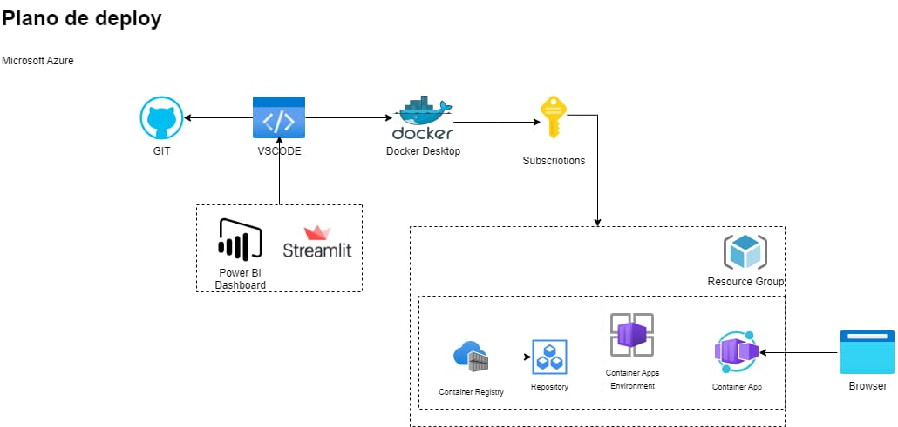
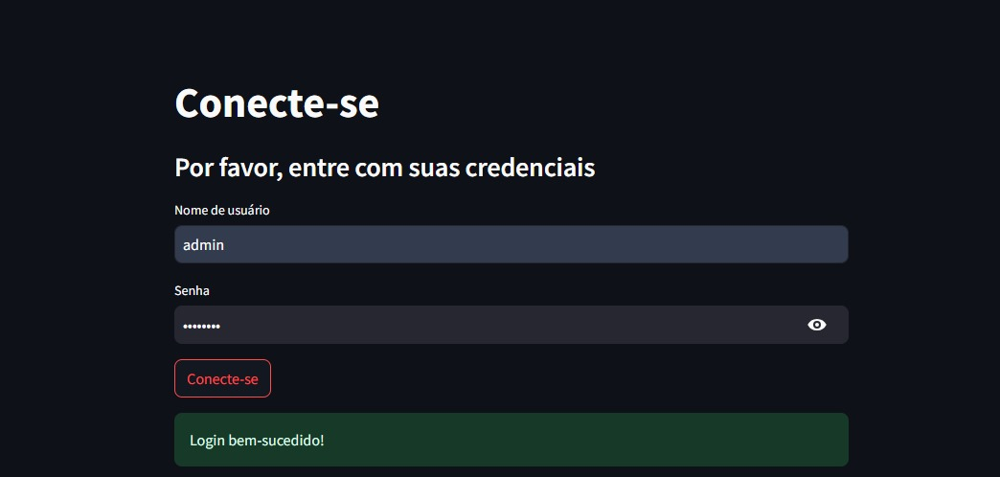

# Projeto de Web Scraping e Autenticação para o Setor de Vinhos - Embrapa

Este projeto foi desenvolvido como parte de uma entrega acadêmica, voltado ao setor de vinhos, para a empresa Embrapa. O sistema é capaz de realizar autenticação via JWT e executar web scraping de dados específicos sobre uvas, vinhos e derivados, contribuindo para análises detalhadas e relatórios estratégicos. Além disso, inclui um dashboard interativo para análise exploratória dos dados.

## Integrantes do Grupo 2

- **Adilson Hideki**
- Matrícula: RM356892<div>
<a href="https://www.linkedin.com/in/adilson-hideki-yamaguchi/" target="_blank"></a>   
</div>

- **Arthur Mendes**
- Matrícula: RM357130<div>
<a href = "mailto:arthur.c.mendes@hotmail.com"></a>
<a href="https://www.linkedin.com/in/arthur-corr%C3%AAa-mendes-296301190/" target="_blank"></a>   
</div>

- **Jair Almeida**
- Matrícula: RM357111<div>
<a href="https://www.linkedin.com/in/jair-santos-8a715a63/" target="_blank"></a>   
</div>

- **Luis Gustavo**
- Matrícula: RM357109<div>
<a href="https://www.linkedin.com/in/luisbi/" target="_blank"></a>   
</div>


## Estrutura do Projeto

- **`main.py`**: Arquivo principal da aplicação FastAPI, contendo todas as rotas e lógicas essenciais.
- **`app.py`**: Arquivo principal do dashboard Streamlit para análise exploratória.
- **`data/`**: Diretório onde está armazenado o banco de dados SQLite (`techchallenge01.db`) e os arquivos de configuração (`parametros.json`).
- **`Utils/`**: Contém classes e funções utilitárias, incluindo a classe `WebScraping`, que encapsula a lógica de extração de dados relacionadas ao setor de vinhos do site da Embrapa.
- **`model/`**: Contém a lógica de negócios e tipos personalizados, como as enumerações `eTipo` e `eSubTipo`, utilizadas para categorizar diferentes operações relacionadas à produção, processamento, comercialização, importação e exportação de uvas, vinhos e derivados.
- **`DOC/`**: Contém documentos auxiliares e imagens, incluindo o arquivo `deploy.jpg` e `streamlit.jpg`.

## Imagem do Deploy

A seguir, uma imagem que ilustra o processo de deploy da aplicação:



## Tela Inicial do Dashboard

Abaixo está uma captura de tela da interface inicial do dashboard feito com Streamlit:



## Explicação do Código

### Enumerações em `model`

#### `eSubTipo`

Essa enumeração categoriza os subtipos relacionados ao setor de vinhos, abrangendo processamento, importação e exportação. Cada subtipo é definido com um código e um nome:

- **PROCESSAMENTO**: Inclui subtipos como Viníferas, Americanas e híbridas, Uvas de mesa e Sem classificação.
- **IMPORTACAO**: Subtipos como Vinhos de mesa, Espumantes, Uvas frescas, Uvas passas e Suco de uva.
- **EXPORTACAO**: Subtipos como Vinhos de mesa, Espumantes, Uvas frescas e Suco de uva.

A função `get_by_codigo` é um método utilitário que busca um subtipo com base no código fornecido.

#### `eTipo`

Essa enumeração categoriza os tipos principais de operações no setor de vinhos:

- **PRODUCAO**: Representa a produção, sem subtipo.
- **PROCESSAMENTO**: Relacionado ao `eSubTipo.PROCESSAMENTO`.
- **COMERCIALIZACAO**: Representa a comercialização, sem subtipo.
- **IMPORTACAO**: Relacionado ao `eSubTipo.IMPORTACAO`.
- **EXPORTACAO**: Relacionado ao `eSubTipo.EXPORTACAO`.

Cada tipo é representado por um dicionário que inclui um código, um nome e, opcionalmente, um subtipo.

### Classe `Negocio`

A classe `Negocio` encapsula a lógica de negócio com base nos tipos definidos para o setor de vinhos. Ela oferece uma interface para acessar o código, tipo e subtipo de uma operação:

- **`__init__(self, negocio: eTipo)`**: Inicializa a instância com os atributos `codigo`, `tipo`, e `subtipo` do tipo de negócio selecionado.
- **`__enter__(self)` e `__exit__(self, exc_type, exc_val, exc_tb)`**: Permitem que a classe seja usada em um contexto `with`, facilitando o gerenciamento de recursos e o tratamento de exceções.

## Funcionalidades

- **Autenticação de Usuário:** Implementa OAuth2 com tokens JWT para autenticação segura de usuários.
- **Gerenciamento de Usuários:** Inclui endpoints para registro e autenticação de usuários.
- **Web Scraping:** Oferece vários endpoints para realizar web scraping de diferentes tipos de dados relacionados ao setor de vinhos, como produção, processamento, comercialização, importação e exportação de uvas, vinhos e derivados.
- **Controle de Acesso Baseado em Token:** Todos os endpoints de web scraping exigem um token JWT válido.

## Dashboard de Análise Exploratória com Streamlit

Este projeto inclui um dashboard interativo desenvolvido com Streamlit, que permite a análise exploratória dos dados relacionados ao setor de vinhos. O dashboard fornece visualizações interativas e relatórios para facilitar a compreensão dos dados extraídos.

### Executando o Dashboard

Para rodar o dashboard, siga estas instruções:

1. Navegue até o diretório onde está localizado o arquivo `app.py`.

2. Execute o comando abaixo para iniciar o dashboard:

    ```bash
    streamlit run app.py
    ```

3. Acesse o dashboard:

    Abra seu navegador e vá para [http://localhost:8501](http://localhost:8501).

### Funcionalidades do Dashboard

- **Visualização de Dados:** Apresenta gráficos e tabelas interativas com informações sobre importação e exportação de uvas, vinhos e derivados.
- **Filtros Dinâmicos:** Permite aplicar filtros para analisar diferentes categorias e subcategorias de dados.
- **Relatórios:** Gera relatórios detalhados baseados nas análises realizadas.

## Instruções de Configuração

### Pré-requisitos

- Python 3.8 ou superior
- SQLite
- Uvicorn para executar o servidor ASGI
- Streamlit para o dashboard

### Instalação

1. Clone o repositório:

    ```bash
    git clone https://github.com/seuusuario/seurepositorio.git
    cd seurepositorio
    ```

2. Instale os pacotes Python necessários:

    ```bash
    pip install -r requirements.txt
    pip install streamlit
    ```

3. Configure o banco de dados SQLite:

    Certifique-se de que o arquivo `data/techchallenge01.db` exista com as tabelas necessárias. Se não existir, crie e configure conforme necessário.

4. Configure o ambiente:

    Certifique-se de que o arquivo `config/parametros.json` exista com as configurações apropriadas para `SECRET_KEY`, `ALGORITHM` e `ACCESS_TOKEN_EXPIRE_MINUTES`.

## Executando a Aplicação

### Aplicação FastAPI

1. Inicie o servidor FastAPI:

    ```bash
    uvicorn main:app --reload
    ```

2. Acesse a aplicação:

    Abra seu navegador e navegue para [http://127.0.0.1:8000](http://127.0.0.1:8000).

3. Documentação Interativa da API:

    O FastAPI gera automaticamente uma documentação interativa da API, que pode ser acessada em:

    - **Swagger UI:** [http://127.0.0.1:8000/docs](http://127.0.0.1:8000/docs)
    - **ReDoc:** [http://127.0.0.1:8000/redoc](http://127.0.0.1:8000/redoc)

### Dashboard Streamlit

1. Navegue até o diretório onde está localizado o arquivo `app.py`.

2. Execute o comando abaixo para iniciar o dashboard:

    ```bash
    streamlit run app.py
    ```

3. Acesse o dashboard:

    Abra seu navegador e vá para [http://localhost:8501](http://localhost:8501).

## Uso

### Registro de Usuário

- **Endpoint:** POST `/CadastrarUsuario`
- **Descrição:** Registra um novo usuário com nome de usuário e senha.
- **Parâmetros:**
  - `username` (str): O nome de usuário a ser registrado.
  - `password` (str): A senha em texto simples.

### Login de Usuário

- **Endpoint:** POST `/token`
- **Descrição:** Autentica um usuário e retorna um token JWT.
- **Parâmetros:**
  - `username` (str): O nome de usuário.
  - `password` (str): A senha em texto simples.

### Endpoints de Web Scraping

Cada endpoint requer um token JWT válido:

- **GET** `/WebScrapingProducao`: Realiza scraping de dados de produção de uvas e vinhos.
- **GET** `/WebScrapingProcessamento`: Realiza scraping de dados de processamento de uvas e vinhos.
- **GET** `/WebScrapingComercializacao`: Realiza scraping de dados de comercialização de vinhos e derivados.
- **GET** `/WebScrapingImportacao`: Realiza scraping de dados de importação de vinhos e derivados.
- **GET** `/WebScrapingExportacao`: Realiza scraping de dados de exportação de vinhos e derivados.

## Considerações de Segurança

- Mantenha o `SECRET_KEY` confidencial.
- Rode regularmente a chave secreta (`SECRET_KEY`) do JWT.
- Defina tempos de expiração apropriados para os tokens.
- Use HTTPS em produção para garantir a segurança na transmissão dos tokens.
